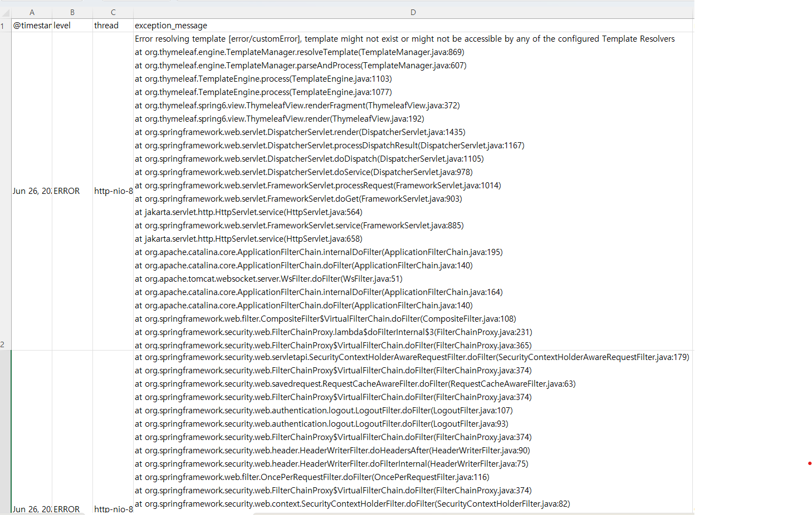

# Kafka + ELK 기반 로그 관리 제안서(v1.0)

## ✅검토 배경

> 로그는 단순한 출력물이 아니라,
의미 있는 지표를 담고 있는 데이터라고 생각했습니다.
이 로그들을 잘 정리하고 구조화한다면,
프로그램의 품질과 개발 효율이 한층 더 나아질 수 있을 것 같아
Kafka + ELK 기반의 로그 관리 방안을 생각하게 되었습니다.

## ✅용어 정리
### 🔹 Kafka란?

Kafka는 대용량의 로그나 데이터를 **실시간으로 수집하고 전달하는 메시지 큐 시스템**입니다.
로그 데이터를 중앙에 모아서, 다른 시스템(Logstash, DB, 모니터링 도구 등)이 필요할때 구독해서 처리할 수 있도록 해줍니다.

- 대규모 데이터 처리에 적합
- 마이크로 서비스, 이벤트 기반 구조에 널리 사용
- 로그 유실 방지 및 분산 처리 강점

| 구성 요소     | 설명 |
|--------------|------|
| Producer     | 데이터를 Kafka로 전송하는 주체 (예: 웹 서버) |
| Consumer     | Kafka에서 데이터를 읽어 가공하는 주체 (예: DB 저장, 알림 처리 등) |
| Broker       | Kafka 서버 단위. 여러 개로 클러스터를 구성 |
| Topic        | 메시지를 주제별로 분류하는 단위 (예: `log-topic`) |
| Partition    | Topic 내 메시지를 나누어 저장하는 단위 |
| Offset       | 각 메시지의 고유 번호 (Consumer가 어디까지 읽었는지 식별) |
---
### 🔹 ELK란?

** ELK ** 는 Elasticsearch, Logstash, Kibana 세 가지 오픈 소스 툴의 조합입니다.

| 구성 요소 | 설명 |
|------------|------|
| **Elasticsearch (ES)** | 로그를 저장하고 검색하는 고속 검색 엔진 |
| **Logstash** | 로그 데이터를 수집·정제·변환하는 데이터 파이프라인 도구 |
| **Kibana** | 로그를 시각화하고 대시보드로 보여주는 UI 도구 |

이 세 가지를 결합하면, 수집한 로그를  
**자동으로 정리 → 저장 → 분석 → 시각화**까지 할 수 있습니다.

## ✅기대효과

| 항목          | 기대 효과 |
|-------------|------------|
| 신속한 로그 파악   | 에러 로그 실시간 추적 |
| 사용자 흐름 파악   | 로그 기반 사용자 행동 분석 가능 (e.g. 로그인 → 검색 → 오류 발생) |
| 기능 개선 근거 확보 | 어떤 기능이 자주/덜 사용되는지 데이터로 파악 가능 |
| 보안 관점       | 비정상 요청 패턴 탐지 및 알림 가능 |
|로그 기록 분류 | 활용 목적에 따라 다양한 방식으로 로그를 분류 가능
---

## ✅ 내부 구성 설명
### 🔹 전체 구성 흐름
>프론트엔드(WebBrowser)에서 발생한 오류 → Spring Boot 애플리케이션에서 처리된 서버 오류 → Kafka(app-logs) → Logstash → Elasticsearch에 저장 → Kibana 대시보드로 시각화
---
### 🔹 실행 화면

#### - 로그 데이터를 항목별로 정리하여 한눈에 파악

#### - 수집된 전체 로그 중 **선택한 필드 기반(예: 로그 레벨, 에러 유형 등)**으로 로그를 분류하여 비율 분석

#### - 선택한 필드 기반 로그를 비율을 여러 차트 형태로 표시

#### - 특정 필드를 기준으로 필터링하여 불필요한 데이터를 제외하고 원하는 로그만 추려서 분석가능

#### - 시간대별로 로그 파악

#### - 조회한 로그 데이터를 CSV(엑셀) 형식으로 내보내기(export)가능

---
### 🔹 실행 순서
1. Docker를 통해 컨테이너들을 실행
2. 애플리케이션(Spring Boot)을 실행
3. 브라우저에서 `http://localhost:5601/app/home#/` 접속
4. `Add integrations` 버튼 클릭
5. 좌측 상단 햄버거 메뉴 클릭 → `Analytics > Discover` 이동
6. `Create index pattern` 클릭
   
7. Name에 `app-logs-*` 입력
8. @timestamp 선택
   
9. `Create index pattern` 클릭
10. 좌측 상단 햄버거 메뉴 클릭 → `Analytics > Discover` 이동
---
### 🔹 도커 명령어
| 명령어               | 설명                      |
|----------------------|---------------------------|
| `docker-compose down` | 컨테이너 종료 및 삭제        |
| `docker-compose up -d` | 컨테이너 백그라운드 실행     |
| `docker ps -a`        | 실행 중인 모든 컨테이너 확인 |

## ✅ 의문점 및 제안사항
### 🔹 의문점
- Kafka는 대용량 로그 처리에 특화된 도구이기 때문에,
  현재처럼 비교적 소규모인 프로그램에 과한 선택일 수 있음
  → 보다 경량화된 로그 수집 도구인 Filebeat 도입도 고려해볼 만함
- 단순한 로그를 파악하는 것에 그치지않고, 좀더 의미있는 목적을 가지고 파악이 가능한지
- 납품처에 프로그램을 배포한 이후에 해당 환경에서 발생하는 로그를 수집하고 확인할 수 있는지?
- ...
---
### 🔹 제안사항
- 로그 포맷 통일  (공통 필드 정의)
- Kafka 전송 전, Logback 설정 또는 Logstash 필터를 통해 중요 로그만 전송하도록 구조
- ...